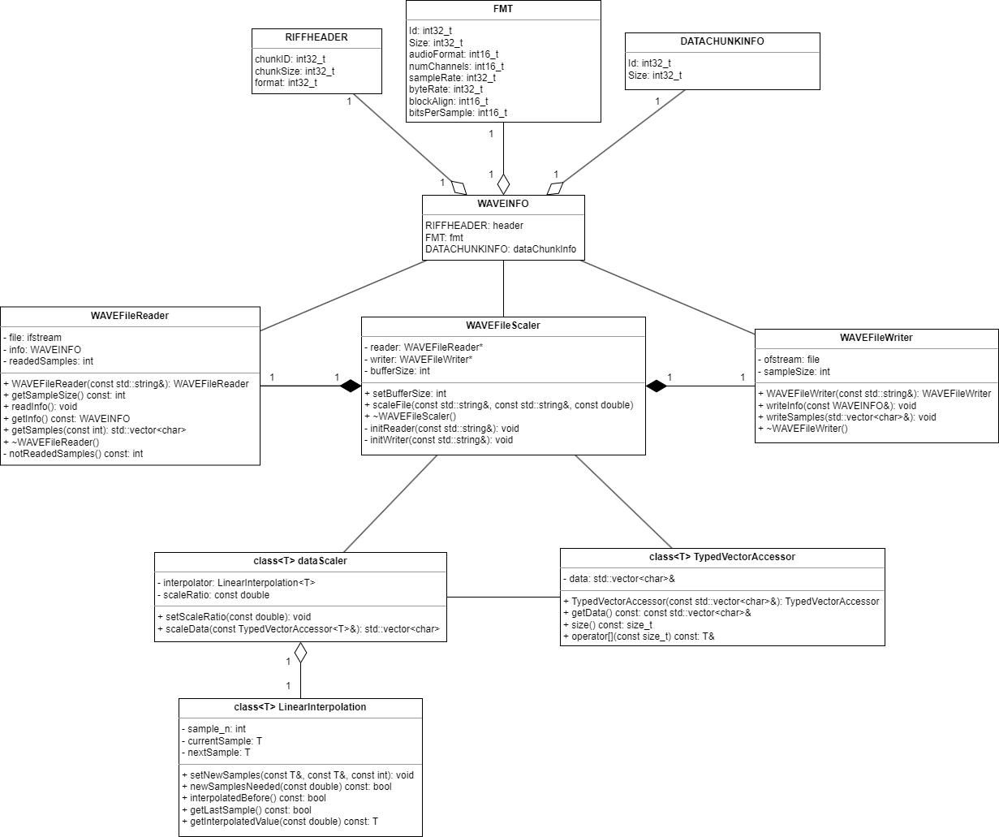

# WAVE-File-Processor
Simple C++ program for speeding up or slowing down .wav files using [linear interpolation](https://en.wikipedia.org/wiki/Linear_interpolation).

Usage:
programName.exe inputFile.wav outputFile.wav scaleRatio

Constraint, scale ratio must be between 0.01 and 100. The default reading buffer size is 10000 samples, which can be edited in code.

## UML Class Diagram

## WAVE files format

